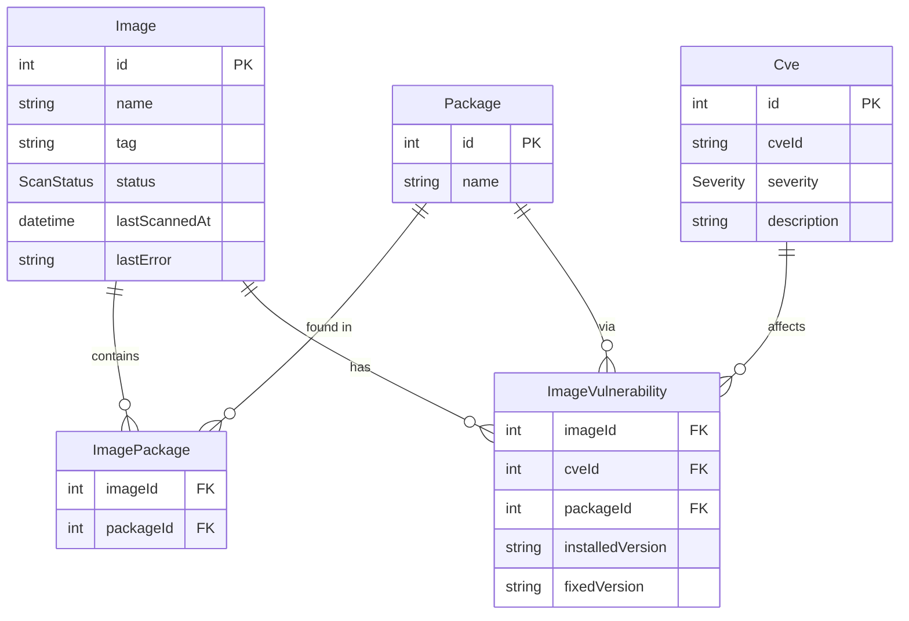

# Echo Security Scanner

A background service that periodically scans 10 fixed container images for CVE vulnerabilities using [Trivy](https://github.com/aquasecurity/trivy), persists results in PostgreSQL via Prisma, and exposes a REST API built with Express.

---

## Architecture overview

```
+------------------+                   +------------------+
|   Express API    |                   |  Trivy server    |
|     :3000        |                   |     :8080        |
+--------+---------+                   +--------^---------+
         |                                      |
         | (read)                               |
         v                            +---------+---------+
   PostgreSQL :5432 <--- (write) ---  |  BullMQ service  |
                                      |  (scan + cleanup) |
                        Redis :6379 --+                   |
                                      +-------------------+
```

The system is split into two independently deployable services:

- **API service** (`src/api/`): serves the REST endpoints with read-only DB queries. Has no knowledge of Redis, BullMQ, or Trivy.
- **BullMQ service** (`src/bullmq/`): general-purpose task runner. Currently runs two tasks:
  - **Trivy scanner** (`tasks/scanners/trivy/`): scans images on a configurable interval; each image is a separate sandboxed job. Writes results to PostgreSQL.
  - **Stale-vuln-cleanup job** (`tasks/stale-vuln-cleanup/`): runs weekly and hard-deletes `ImageVulnerability` rows older than 30 days (see [CVE staleness](#cve-staleness) below).
- **Trivy server**: runs in server mode; the BullMQ worker calls `trivy image --server` (no Docker socket needed on the worker).
- **PostgreSQL** + **Prisma**: stores images, CVEs, packages, and join tables. The database is the only contract between API and BullMQ.
- **Redis**: BullMQ job queue and scheduler backend (BullMQ service only).

---

## Database schema



---

## Prerequisites

| Tool | Min version | Install |
|---|---|---|
| Docker + Docker Compose | 29.x | [docker.com](https://docker.com) |
| Node.js | 24.x | [nodejs.org](https://nodejs.org) or `fnm install 24` |
| pnpm | 11.x | `npm install -g pnpm` |

---

## Quick start

### 1. Clone and prepare

```bash
git clone <repo>
cd echo-security-scanner

# Copy and review environment defaults
cp .env.example .env
```

### 2. Pre-pull scan target images

Trivy's client/server split means the **client** (bullmq) downloads each image locally and extracts its package list, then sends only the package list to the server for CVE lookup. Without local copies, trivy falls back to pulling from Docker Hub on every scan tick, which quickly exhausts the unauthenticated rate limit (100 req / 6 h).

Run this once before starting the stack (or after adding new images to `src/bullmq/tasks/scanners/images.ts`):

```bash
pnpm pull-images
```

Images already present in the local daemon are skipped, so re-running is safe and fast.

### 3. Start the full stack

```bash
docker compose up --build -d
```

> **First run:** Trivy downloads its vulnerability database (~several hundred MB) before becoming healthy.
> The `bullmq` service waits until Trivy is ready (`start_period: 5m`).
> Subsequent starts reuse the `trivy_cache` volume and are fast (~seconds).

### 4. Verify all five services are healthy

```bash
docker compose ps
```

Expected — all five STATUS values should show `(healthy)`:

```
NAME       STATUS
api        Up ... (healthy)
bullmq     Up ... (healthy)
postgres   Up ... (healthy)
redis      Up ... (healthy)
trivy      Up ... (healthy)
```

### 5. Wait for the first scan batch

The BullMQ service enqueues all 10 images on startup via the scheduler tick. Each scan takes 10-60 s depending on Trivy's cache state.

```bash
# Poll until at least one image shows SUCCESS
watch -n 5 'curl -s http://localhost:3000/api/images | jq "[.data[] | {name,tag,status}]"'
```

---

## API endpoints

All responses use the envelope `{ data: T }` on success and `{ error: { message, code? } }` on failure.

### `GET /health`

Overall health of the API, including DB connectivity and scanner staleness (time since last successful scan).

```bash
curl -s http://localhost:3000/health | jq
```

```json
{
  "data": {
    "db": "ok",
    "scanner": "ok",
    "status": "ok"
  }
}
```

- `db`: result of a lightweight DB ping.
- `scanner`: `"ok"` if at least one image has been scanned recently, `"stale"` if no scans have completed within the expected interval.

Returns **200** if healthy, **503** if degraded.

---

### `GET /api/images`

All scanned images with CVE counts grouped by severity.

```bash
curl -s http://localhost:3000/api/images | jq '.data[0]'
```

```json
{
  "id": 1,
  "name": "nginx",
  "tag": "1.19",
  "status": "SUCCESS",
  "lastScannedAt": "2026-05-10T00:00:00.000Z",
  "cveCountBySeverity": {
    "CRITICAL": 5,
    "HIGH": 12,
    "MEDIUM": 8,
    "LOW": 3,
    "UNKNOWN": 0,
    "total": 28
  }
}
```

---

### `GET /api/images/:name/:tag/cves`

CVEs found in a specific image. Optional `?severity=` filter.

```bash
# All CVEs for nginx:1.19
curl -s "http://localhost:3000/api/images/nginx/1.19/cves" | jq '.data | length'

# Only CRITICAL CVEs
curl -s "http://localhost:3000/api/images/nginx/1.19/cves?severity=CRITICAL" | jq '.data[0]'
```

Valid `severity` values: `CRITICAL`, `HIGH`, `MEDIUM`, `LOW`

Returns **404** if the image has never been scanned. Returns **400** for invalid severity.

---

### `GET /api/cves`

All unique CVEs found across all images. Optional `?severity=` filter.

```bash
curl -s "http://localhost:3000/api/cves?severity=CRITICAL" | jq '.data | length'
```

---

### `GET /api/cves/:cveId/images`

All images affected by a specific CVE, including installed/fixed version details.

```bash
curl -s "http://localhost:3000/api/cves/CVE-2026-7168/images" | jq '.data'
```

---

## Log tailing

Each service writes logs to its own subfolder under `./logs/`. Level files receive that level **and above**:

| File | Contents |
|---|---|
| `logs/api/api.debug.log` | All API log records (debug+) -- current file |
| `logs/api/api.debug.log.1` | Previous rotated file (older = higher number) |
| `logs/api/api.info.log` | Info, warn, error, fatal |
| `logs/api/api.error.log` | Error and fatal only |
| `logs/bullmq/bullmq.debug.log` | BullMQ main process: scheduler ticks, stale-vuln-cleanup job, startup/shutdown |
| `logs/bullmq/trivy-scanner.debug.log` | Sandboxed scan processors: per-image scan results, ingestion steps |
| `logs/postgres/postgres-YYYY-MM-DD.log` | Postgres server logs |
| `logs/redis/redis.log` | Redis server logs |
| `logs/trivy/trivy.log` | Trivy server logs |

```bash
# Stream info logs from the API (no suffix = current file)
tail -f logs/api/api.info.log | jq

# Stream all BullMQ records (scheduler ticks, stale-vuln-cleanup, startup)
tail -f logs/bullmq/bullmq.debug.log | jq .msg

# Stream per-image scan progress and results
tail -f logs/bullmq/trivy-scanner.debug.log | jq '{image: .image, msg: .msg}'

# Infrastructure logs
tail -f logs/redis/redis.log
tail -f logs/trivy/trivy.log

# Or via Docker
docker compose logs -f redis
docker compose logs -f trivy
```

Timestamps are ISO-8601 strings (`"time":"2026-05-10T12:00:00.000Z"`).

---

## Running tests

### Unit tests -- no Docker required

```bash
pnpm install
pnpm test --testPathPattern="unit"
```

### Integration tests -- requires Docker (testcontainers)

```bash
pnpm test --testPathPattern="integration"
```

### Full suite

```bash
pnpm test
```

Tests run sequentially (`--runInBand`) to avoid resource contention between multiple testcontainers instances.

---

## Development

```bash
# Start only infrastructure
docker compose up postgres redis trivy-server -d

# API in watch mode (auto-reloads on save)
pnpm dev

# BullMQ worker in watch mode
pnpm dev:worker
```

> **Local dev:** update `DATABASE_URL`, `REDIS_URL`, and `TRIVY_SERVER_URL` in `.env` to use `localhost` instead of the Docker container hostnames.

---

## Stopping

```bash
# Stop and preserve data volumes
docker compose down

# Stop and remove all data
docker compose down -v
```

---

## Rule deviations

| Rule file | Original | Deviation | Reason |
|---|---|---|---|
| `architecture.md` | `cveId @unique`, single `packageId` FK on Vulnerability | Normalized: `Cve(cveId @unique)` + `Package` + `ImageVulnerability(imageId, cveId, packageId)` | Same CVE can affect multiple packages -- original schema causes upsert collisions on real Trivy output |
| `performance.md` | Worker Thread if `JSON.parse` > 100ms | `stream-json` streaming always | Streaming bounds memory and never blocks the event loop; Worker Thread overhead unjustified |
| `docker.md` | Mount docker.sock on Worker and Trivy Server | Mount on `trivy-server` only | `trivy --server` sends the image reference to the server which pulls it; worker socket mount is unnecessary attack surface |
| Compose service name | `worker` | Renamed `bullmq` | "worker" overloaded with BullMQ `Worker` class and Node.js Worker Threads |

---

## CVE staleness

The scanner uses an upsert-only persistence approach -- it never deletes CVE records. Instead, every scan updates `ImageVulnerability.lastSeenAt` to `now()` for each CVE it finds. The same timestamp is also written to `Image.lastScannedAt` at the end of the scan.

**API filtering:** all vulnerability queries apply the filter `lastSeenAt >= lastScannedAt`. This means:
- CVEs confirmed by the latest scan: `lastSeenAt === lastScannedAt` -> **included**
- CVEs no longer found (patched, withdrawn, reclassified): `lastSeenAt < lastScannedAt` -> **excluded**

Stale rows are preserved in the database as audit data -- `firstSeenAt` records when a CVE was first detected, and `lastSeenAt` records when it was last confirmed. This is useful for understanding exposure windows.

**Weekly stale-vuln-cleanup job:** a separate BullMQ repeatable job runs every 7 days and hard-deletes `ImageVulnerability` rows where `lastSeenAt < now() - 30 days`. This is purely operational -- preventing unbounded table growth. It does NOT affect the staleness logic above. Only `ImageVulnerability` rows are deleted; `Cve` and `Package` rows (reference data) are never touched.

---

## Adding a new task or scanner

Tasks live under `src/bullmq/tasks/`. Each task module exports a `TaskConfig` (see `src/bullmq/tasks/task.types.ts`).

**To add a new scanner** (e.g. Grype):
1. Create `src/bullmq/tasks/scanners/grype/` alongside `trivy/`
2. Implement `scan-image.job.ts`, `scanner.service.ts`, `scheduler-tick.job.ts` following the Trivy pattern
3. Export a `TaskConfig` from `index.ts`
4. Import it in `src/bullmq/services/scheduler.service.ts` and add a `upsertJobScheduler` + `Worker` registration

**To add an unrelated background task** (e.g. report generation):
1. Create `src/bullmq/tasks/<name>/` alongside `stale-vuln-cleanup/`
2. Implement the processor function
3. Export a `TaskConfig` from `index.ts`
4. Register it in `scheduler.service.ts`

The scheduler does NOT auto-discover tasks -- adding a new task requires one import in `scheduler.service.ts`.

---

## Notable implementation decisions

- **Sandboxed BullMQ processors**: each scan job forks a child process. Crash-isolates Trivy and stream-json failures at the cost of one extra process per concurrent job.
- **Unique jobIds with wall-clock timestamp** (`scan__nginx__1.19__<ts>`): BullMQ v5 forbids `:` in custom jobIds. The timestamp is captured at tick invocation time (not stored in the scheduler template) so each batch produces distinct jobIds, preventing BullMQ from deduplicating new jobs against completed ones.
- **Sequential test execution** (`--runInBand`): three integration test suites each start testcontainers (Postgres and/or Redis). Parallel execution exhausts resources on typical dev machines.
- **Cumulative log routing**: `debug.log` receives all levels; `info.log` receives info and above; `error.log` receives error and fatal only -- so operators can grep debug.log for the full picture or error.log for just failures.
- **Separate log files per process type**: the main BullMQ process writes to `bullmq.*.log`; sandboxed scan processors write to `trivy-scanner.*.log`. This avoids concurrent multi-process writes to the same rotating log file.
- **`prisma` in production deps**: `prisma migrate deploy` runs on API startup so the CLI must be present in the production image.
