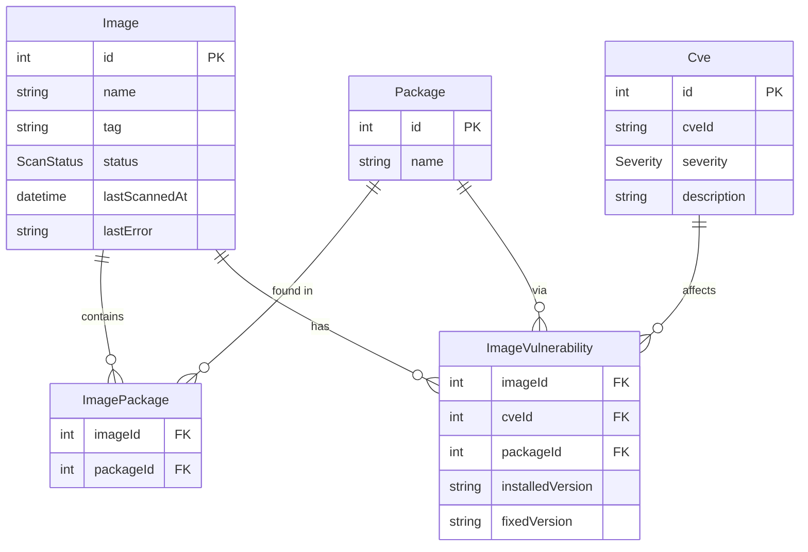

# Echo Security Scanner

A background service that periodically scans 10 fixed container images for CVE vulnerabilities using [Trivy](https://github.com/aquasecurity/trivy), persists results in PostgreSQL via Prisma, and exposes a REST API built with Express.

---

## Architecture overview

```
┌─────────────┐                        ┌──────────────────┐
│   Express   │                        │  Trivy server    │
│  API :3000  │                        │  :8080           │
└──────┬──────┘                        └────────▲─────────┘
       │ (read)                                  │
       ▼                               ┌─────────┴────────┐
  PostgreSQL :5432  ◀──── (write) ─── │  Scanner service │
                                       │  (BullMQ worker) │
                         Redis :6379 ──│                  │
                                       └──────────────────┘
```

The system is split into two independently deployable services:

- **API service** (`src/api/`): serves the REST endpoints with read-only DB queries. Has no knowledge of Redis, BullMQ, or Trivy.
- **Scanner service** (`src/scanner/`): scans images every 15 minutes via BullMQ; each image is a separate sandboxed job. Writes results to PostgreSQL. Owns Redis and Trivy.
- **Trivy server**: runs in server mode; the scanner calls `trivy image --server` (no Docker socket needed on the scanner).
- **PostgreSQL** + **Prisma**: stores images, CVEs, packages, and join tables. The database is the only contract between API and Scanner.
- **Redis**: BullMQ job queue and scheduler backend (Scanner only).

---

## Database schema



---

## Prerequisites

| Tool | Min version | Install |
|---|---|---|
| Docker + Docker Compose | 29.x | [docker.com](https://docker.com) |
| Node.js | 24.x | [nodejs.org](https://nodejs.org) or `fnm install 24` |
| pnpm | 11.x | `npm install -g pnpm` |

---

## Quick start

### 1. Clone and prepare

```bash
git clone <repo>
cd echo-security-scanner

# Create the host log directory (avoids root-owned dirs on Linux)
mkdir -p logs

# Copy and review environment defaults
cp .env.example .env
```

### 2. Start the full stack

```bash
docker compose up --build -d
```

> **First run:** Trivy downloads its vulnerability database (~several hundred MB) before becoming healthy.
> The `bullmq` service waits until Trivy is ready (`start_period: 5m`).
> Subsequent starts reuse the `trivy_cache` volume and are fast (~seconds).

### 3. Verify all five services are healthy

```bash
docker compose ps
```

Expected — all five STATUS values should show `(healthy)`:

```
echo-security-scanner-api-1          Up … (healthy)
echo-security-scanner-scanner-1      Up … (healthy)
echo-security-scanner-postgres-1     Up … (healthy)
echo-security-scanner-redis-1        Up … (healthy)
echo-security-scanner-trivy-server-1 Up … (healthy)
```

### 4. Wait for the first scan batch

The Scanner service enqueues all 10 images on startup. Each scan takes 10–60 s depending on Trivy's cache state.

```bash
# Poll until at least one image shows SUCCESS
watch -n 5 'curl -s http://localhost:3000/api/images | jq "[.data[] | {name,tag,status}]"'
```

---

## API endpoints

All responses use the envelope `{ data: T }` on success and `{ error: { message, code? } }` on failure.

### `GET /health`

Overall health of the API, including DB connectivity and scanner staleness (time since last successful scan).

```bash
curl -s http://localhost:3000/health | jq
```

```json
{
  "data": {
    "db": "ok",
    "scanner": "ok",
    "status": "ok"
  }
}
```

- `db`: result of a lightweight DB ping.
- `scanner`: `"ok"` if at least one image has been scanned recently, `"stale"` if no scans have completed within the expected interval.

Returns **200** if healthy, **503** if degraded.

---

### `GET /api/images`

All scanned images with CVE counts grouped by severity.

```bash
curl -s http://localhost:3000/api/images | jq '.data[0]'
```

```json
{
  "id": 1,
  "name": "nginx",
  "tag": "1.19",
  "status": "SUCCESS",
  "lastScannedAt": "2026-05-10T00:00:00.000Z",
  "cveCountBySeverity": {
    "CRITICAL": 5,
    "HIGH": 12,
    "MEDIUM": 8,
    "LOW": 3,
    "UNKNOWN": 0,
    "total": 28
  }
}
```

---

### `GET /api/images/:name/:tag/cves`

CVEs found in a specific image. Optional `?severity=` filter.

```bash
# All CVEs for nginx:1.19
curl -s "http://localhost:3000/api/images/nginx/1.19/cves" | jq '.data | length'

# Only CRITICAL CVEs
curl -s "http://localhost:3000/api/images/nginx/1.19/cves?severity=CRITICAL" | jq '.data[0]'
```

Valid `severity` values: `CRITICAL`, `HIGH`, `MEDIUM`, `LOW`

Returns **404** if the image has never been scanned. Returns **400** for invalid severity.

---

### `GET /api/cves`

All unique CVEs found across all images. Optional `?severity=` filter.

```bash
curl -s "http://localhost:3000/api/cves?severity=CRITICAL" | jq '.data | length'
```

---

### `GET /api/cves/:cveId/images`

All images affected by a specific CVE, including installed/fixed version details.

```bash
curl -s "http://localhost:3000/api/cves/CVE-2021-44228/images" | jq '.data'
```

---

## Log tailing

All app logs land in `./logs/` on the host. Each level file receives that level **and above**:

| File | Contents |
|---|---|
| `logs/api.debug.1.log` | All log records (debug+) |
| `logs/api.info.1.log` | Info, warn, error, fatal |
| `logs/api.error.1.log` | Error and fatal only |
| `logs/scanner.*.log` | Same pattern for the scanner service |
| `logs/postgres-YYYY-MM-DD.log` | Postgres server logs |

```bash
# Stream info logs from the API
tail -f logs/api.info.1.log | jq

# Stream all records from the scanner (scan progress, retries, etc.)
tail -f logs/scanner.debug.1.log | jq .msg

# Redis and Trivy use Docker's json-file driver
docker compose logs -f redis
docker compose logs -f trivy-server
```

Timestamps are ISO-8601 strings (`"time":"2026-05-10T12:00:00.000Z"`).

---

## Running tests

### Unit tests — no Docker required

```bash
pnpm install
pnpm test --testPathPattern="unit"
```

### Integration tests — requires Docker (testcontainers)

```bash
pnpm test --testPathPattern="integration"
```

### Full suite

```bash
pnpm test
```

Tests run sequentially (`--runInBand`) to avoid resource contention between multiple testcontainers instances.

---

## Development

```bash
# Start only infrastructure
docker compose up postgres redis trivy-server -d

# API in watch mode (auto-reloads on save)
pnpm dev

# BullMQ worker in watch mode
pnpm dev:worker
```

---

## Stopping

```bash
# Stop and preserve data volumes
docker compose down

# Stop and remove all data
docker compose down -v
```

---

## Rule deviations

| Rule file | Original | Deviation | Reason |
|---|---|---|---|
| `architecture.md` | `cveId @unique`, single `packageId` FK on Vulnerability | Normalized: `Cve(cveId @unique)` + `Package` + `ImageVulnerability(imageId, cveId, packageId)` | Same CVE can affect multiple packages — original schema causes upsert collisions on real Trivy output |
| `performance.md` | Worker Thread if `JSON.parse` > 100ms | `stream-json` streaming always | Streaming bounds memory and never blocks the event loop; Worker Thread overhead unjustified |
| `docker.md` | Mount docker.sock on Worker and Trivy Server | Mount on `trivy-server` only | `trivy --server` sends the image reference to the server which pulls it; worker socket mount is unnecessary attack surface |
| Compose service name | `worker` | Renamed `scanner` | "worker" overloaded with BullMQ `Worker` class and Node.js Worker Threads; "bullmq" too implementation-specific |

---

## Notable implementation decisions

- **Sandboxed BullMQ processors**: each scan job forks a child process inside the Scanner service. Crash-isolates Trivy and stream-json failures at the cost of one extra process per concurrent job.
- **Stable jobIds** (`scan__nginx__1.19`): BullMQ v5 forbids `:` in custom jobIds. A stable (no timestamp) ID means at most one active scan per image in the queue, preventing duplicate concurrent scans.
- **Sequential test execution** (`--runInBand`): three integration test suites each start testcontainers (Postgres and/or Redis). Parallel execution exhausts resources on typical dev machines.
- **Cumulative log routing**: `debug.log` receives all levels; `info.log` receives info and above; `error.log` receives error and fatal only — so operators can grep debug.log for the full picture or error.log for just failures.
- **`prisma` in production deps**: `prisma migrate deploy` runs on API startup so the CLI must be present in the production image.
